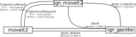
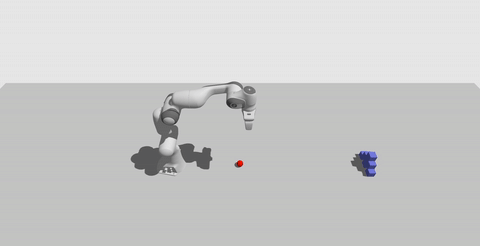

# ign_moveit2

Examples of using [MoveIt2](https://moveit.ros.org) for planning motions that are executed inside [Ignition Gazebo](https://ignitionrobotics.org) simulation environment. These examples do NOT make use of [ros2_control](https://github.com/ros-controls/ros2_control)\*, but instead employ [`JointTrajectoryController`](https://github.com/ignitionrobotics/ign-gazebo/blob/ign-gazebo4/src/systems/joint_trajectory_controller/JointTrajectoryController.hh) Ignition system plugin with the communication grasp illustrated below. All communication and `move_group` action server can be setup using [`ign_moveit2.launch.py`](launch/ign_moveit2.launch.py), which then allows usage with both C++ and Python interface.


This repository previously contained also `JointTrajectory` controller which is now [merged](https://github.com/ignitionrobotics/ign-gazebo/pull/473) into `ign-gazebo`. Therefore, this repository should serve as a template/example of using such setup and no longer needs to be installed.

To demonstrate Python usage, a minimal [Python MoveIt2 interface](moveit2_py/moveit2.py) is also provided in this repository for [Franka Emika Panda](https://github.com/AndrejOrsula/panda_ign.git) because `moveit_commander` is not yet ported as of writing this ([tracker](https://github.com/ros-planning/moveit2/issues/314)). Once Python bindings for MoveIt2 are migrated, it is recommended to use those instead.

\* Once `ros2_control` is ready to use (which it might already be at the time of reading this), then developing and using `ign_ros2_control` similar to [gazebo_ros2_control](https://github.com/ros-simulation/gazebo_ros2_control) might be recommended over the solution proposed in this repository.

## Directory Structure

```bash
├── launch
    ├── ign_moveit2.launch.py    # Helpful launch file that starts up MoveIt2 move_group action server and bridges between ROS 2 and Ignition
    └── examples                 # Launch files for examples
├── examples                     # C++ and Python examples
├── moveit2_py                   # Python module for interfacing with MoveIt2 (temporary substitute for moveit_commander)
├── worlds
    ├── panda_follow.sdf         # Gazebo world for follow examples
    └── panda_throw.sdf          # Gazebo world for throw example
└── panda.repos                  # List of additional dependencies for `Franka Emika Panda`
```

## Dependencies

All examples were tested with the following setup.

- [ROS 2 Foxy](https://index.ros.org/doc/ros2/Installation/Foxy)
- [MoveIt2](https://moveit.ros.org/install-moveit2/source)
- [Ignition Dome](https://ignitionrobotics.org/docs/dome/install) (Citadel might also be fully functional, but it was not tested)
  - `ign-gazebo` >= 4.4
    - Version is required for [`JointTrajectoryController` system plugin](https://github.com/ignitionrobotics/ign-gazebo/commit/14cc8370f052bf5139018d472914491cf6fef3a4)
  - `ign-msgs` >= 6.2
    - Version is required for [`JointTrajectory` message definition](https://github.com/ignitionrobotics/ign-msgs/commit/f53e57e4bf681e5e44d1379d4954efe91fe07a8f)
- [ros_ign](https://github.com/ignitionrobotics/ros_ign/tree/ros2)
  - `ros2` branch, containing [`JointTrajectory` message conversion](https://github.com/ignitionrobotics/ros_ign/commit/a4bc25fde117f9ce7279c83dc419bfb0eb3983b9)

Additional robot-specific dependencies are also required, e.g. [panda.repos](panda.repos).

## Examples

### Building

This step is required to install [Python MoveIt2 interface](moveit2_py/moveit2.py) and additional robot-specific dependencies for Franka Emika Panda in order to try out the examples.

The recommended way is to clone this repository, clone dependencies and build with `colcon`.

```bash
export PARENT_DIR=${PWD}
mkdir -p ign_moveit2/src && cd ign_moveit2/src
git clone https://github.com/AndrejOrsula/ign_moveit2.git
vcs import < ign_moveit2/panda.repos
cd ..
rosdep install --from-paths src -i -y --rosdistro ${ROS_DISTRO}
colcon build --merge-install --symlink-install --cmake-args "-DCMAKE_BUILD_TYPE=Release"
```

### Environment

First, remember to source the ROS 2 workspace overlay before trying out any of the examples below.

```bash
source ${PARENT_DIR}/ign_moveit2/install/local_setup.bash
```

#### Follow Example

```bash
ros2 launch ign_moveit2 example_follow_object.launch.py
```


#### Throw Example

```bash
ros2 launch ign_moveit2 example_throw.launch.py
```


