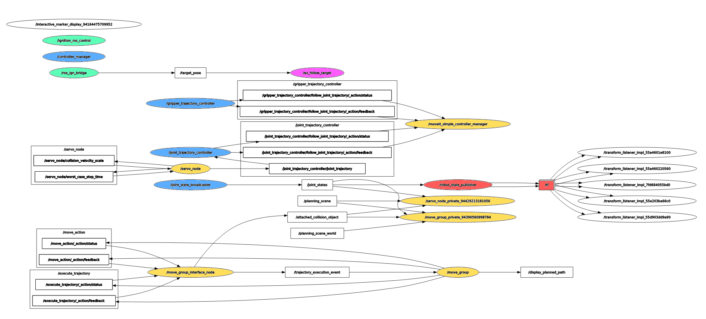

# Example documentation

This document describes the different software components
used by the MoveIt 2, ROS 2 and Gazebo demo,
where to find them and how they are being called.

This example and documentation use the name ***"Gazebo"***
to refer to the new generation of the [Gazebo simulator](https://gazebosim.org/)
not be confused with [Gazebo classic](https://classic.gazebosim.org), the latest
version of which is Gazebo 11. The current "Gazebo" was formerly known as
Ignition Gazebo, so the document contains some references to "ign\_" or
"ignition", like in the name of the repository.

The Ignition Gazebo project was renamed to just
Gazebo or Gz, so the document contains some references to the new URLs
and names, like the ones for
[`gz_ros2_control`](https://github.com/ros-controls/gz_ros2_control),
which should not be confused with
[`gazebo_ros2_control`](https://github.com/ros-controls/gazebo_ros2_control),
the `ros2_control` wrapper for the previous Gazebo classic.

***Note:*** only the Follow Target example is used in this document

The document details:

1. Code repositories being used in the demo
1. How to prepare a Robot URDF for using `Gazebo` with `ros2_control`
1. How to connect `MoveIt 2` with the `Gazebo` `ros2_control` plugins
1. How this example declares the target pose for the manipulation
1. Other important ROS 2 packages for the simulation
1. Graph of runtime ROS 2 topics and nodes

## Code repositories used in the demo

Repositories used:

- [Panda Ign MoveIt 2](https://github.com/AndrejOrsula/panda_ign_moveit2):
  Software packages for Franka Emika Panda Robot that enable manipulation with MoveIt 2
  inside Gazebo. For control, ign_ros2_control is used.

- [ROS Gazebo](https://github.com/gazebosim/ros_gz/tree/galactic)
  This repository holds packages that provide integration between ROS and Gazebo.
  Mainly `ros_ign_package` is being used to launch Gazebo with ROS 2 integration
  and `ros_ign_bridge` to convert Gz messages to ROS messages.

- [Gz ROS 2 Control](https://github.com/ros-controls/gz_ros2_control) for the latest [Gazebo](https://gazebosim.org) (not to be confused with [Gazebo ROS 2 Control](https://github.com/ros-controls/gazebo_ros2_control/tree/galactic) for [Gazebo-classic](https://classic.gazebosim.org)!)
  This is a ROS 2 package for integrating the `ros2_control` controller architecture
  with the `Gazebo` simulator.

### How to prepare a Robot URDF for using Gazebo with ros2_control

Two main actions need to be done to prepare the URDF model to use `Gazebo` and
`ros2_control`: configure `ros2_control` setting using the `ros2_control` URDF
macro, and add a plugin to `Gazebo` to parse the `ros2_control` tags and
load the appropriate hardware interfaces and controller manager.

#### 1. URDF declaration for the [`ros2_control` URDF tag](https://control.ros.org/master/doc/getting_started/getting_started.html#hardware-description-in-urdf)

This is done by adding the xacro macro `ros2_control_panda_arm` (which is
integrated from main Panda arm URDF file) and using the
[`gz_ros2_control/IgnitionSystem`](https://github.com/ros-controls/gz_ros2_control/blob/9f52839be0893d13c1162cb2ed2a6b6df90226c0/README.md?plain=1#L100-L126):

- [panda_description/urdf/panda.ros2_control#L28-L30](https://github.com/AndrejOrsula/panda_ign_moveit2/blob/9e5fabed267db78a91a2cd185ee6a89b799f3be3/panda_description/urdf/panda.ros2_control#L28-L30)

#### 2. URDF declaration for the Gazebo plugin [IgnitionROS2ControlPlugin](https://github.com/ros-controls/gz_ros2_control/blob/9f52839be0893d13c1162cb2ed2a6b6df90226c0/README.md?plain=1#L160-L180)

This is done by adding the xacro macro `gz_ros2_control` (which is integrated
from main Panda URDF file) and adding the Gazebo plugin `IgnitionROS2ControlPlugin`
that parses the `ros2_control` tags and loads the appropriate hardware interfaces and controller manager

- [panda_description/urdf/panda.gazebo#L8-L16](https://github.com/AndrejOrsula/panda_ign_moveit2/blob/9e5fabed267db78a91a2cd185ee6a89b799f3be3/panda_description/urdf/panda.gazebo#L8-L16)

### How to connect MoveIt 2 with the Gazebo ros2_control plugins

The example launches MoveIt using gz_ros2_control:

- [../launch/default.launch.py#L81-L100](https://github.com/AndrejOrsula/ign_moveit2_examples/blob/3fe61b6b7b1704d2fb01b9857f426e1966f95c16/launch/default.launch.py#L81-L100)

This snippet is calling the main [Panda MoveIt configuration launch file](https://github.com/AndrejOrsula/panda_ign_moveit2/blob/9e5fabed267db78a91a2cd185ee6a89b799f3be3/panda_moveit_config/launch/move_group.launch.py):

- Panda main MoveIt 2 move_group invocation:

  - [panda_moveit_config/launch/move_group.launch.py#L247-L264](https://github.com/AndrejOrsula/panda_ign_moveit2/blob/9e5fabed267db78a91a2cd185ee6a89b799f3be3/panda_moveit_config/launch/move_group.launch.py#L247-L264)

- Controller manager

  - [panda_moveit_config/launch/move_group.launch.py#L308-L323](https://github.com/AndrejOrsula/panda_ign_moveit2/blob/9e5fabed267db78a91a2cd185ee6a89b799f3be3/panda_moveit_config/launch/move_group.launch.py#L308-L323)

### How the Follow Target example declares the target pose for the manipulation

This repository uses a `Gazebo PosePublisher` plugin to indicate the target pose for the manipulation:

- [../worlds/follow_target.sdf#L99-L104](https://github.com/AndrejOrsula/ign_moveit2_examples/blob/3fe61b6b7b1704d2fb01b9857f426e1966f95c16/worlds/follow_target.sdf#L99-L104)

Translate the pose from Gazebo to ROS using the `ros_gz_bridge`:

- [../launch/worlds/world_follow_target.launch.py#L60-L74](https://github.com/AndrejOrsula/ign_moveit2_examples/blob/3fe61b6b7b1704d2fb01b9857f426e1966f95c16/launch/worlds/world_follow_target.launch.py#L60-L74)

The `/target_pose` topic is subscribed to by the ROS C++ node that communicates with MoveIt

- [../examples/cpp/ex_follow_target.cpp#L28-L57](https://github.com/AndrejOrsula/ign_moveit2_examples/blob/3fe61b6b7b1704d2fb01b9857f426e1966f95c16/examples/cpp/ex_follow_target.cpp#L28-L57)

### Other important ROS 2 packages

#### Robot state publisher

The Robot State Publisher is a node and a class to publish
the state of a robot to `tf2`. At startup time, Robot State Publisher is
supplied with a kinematic tree model (URDF) of the robot. It then subscribes
to the `joint_states` topic (of type `sensor_msgs/msg/JointState`) to get
individual joint states. More information in the
[ROS 2 tutorial](https://docs.ros.org/en/galactic/Tutorials/Intermediate/URDF/Using-URDF-with-Robot-State-Publisher.html)

- https://github.com/ros/robot_state_publisher

#### TF2

`tf2` is the second generation of the transform library, which lets the user
keep track of multiple coordinate frames over time. `tf2` maintains the
relationship between coordinate frames in a tree structure buffered in
time, and lets the user transform points, vectors, etc between any
two coordinate frames at any desired point in time.

- http://wiki.ros.org/tf2

## ROS 2 Topics and Nodes

Color legend for nodes:

- Green: Gazebo special nodes for ROS integration
- Purple: pose target created by the example code in this repo
- Blue: nodes created and handled by `ros2_control` invoked from `gz_ros_control`
- Yellow: `moveit2` nodes
- Red: other ROS 2 important nodes usually needed for simulations
